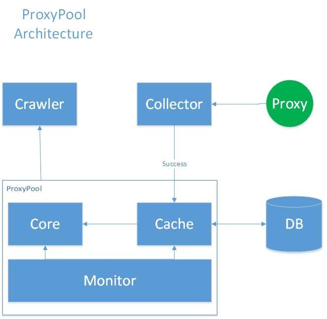

# wcrawler
* wcrawler是一个知乎爬虫，内置ip代理池，结合elastic-job-lite和多线程，执行爬虫任务
* 可抓取用户的关注关系
* 可抓取用户的简介/关注数/粉丝数/赞成数/感谢数/回答数/提问数/文章数

## Quick Start

配置elastic-job的作业
```
    # elastic-job:CrawlerJob
    url.simple.id=CrawlerJob
    url.simple.class=com.wuyi.wcrawler.job.CrawlerJob
    url.simple.cron=0/20 * * * * ?
    url.simple.shardingTotalCount=1
    url.simple.monitorExecution=false
    url.simple.monitorPort=19888
    url.simple.failover=true
    url.simple.disabled=false
    url.simple.overwrite=true

```
url.simple.cron: 用cron表达式来控制作业的执行；
url.simple.disabled：false，该作业可以执行；true，该作业不可执行；

```
    public class WcrawlerTest {
        public static void main(String[] args ) throws InterruptedException {
            Config config = Config.newInstance()
                    .setTarAmount(3000)
                    .setRunningTime(3600 * 1000)
                    .setCheckInterval(500)
                    .setProxyFlag(true)
                    .setProxySelectPolicy(ProxySelectPolicy.RANDOM);
            Wcrawler wcrawler = new Wcrawler(config);
            wcrawler.start();
        }
    }
```
使用Config配置爬虫任务的参数：
* tarMount：期望爬取的用户总数
* runningTime：任务的执行时长
* checkInterval：任务状态检查的时间间隔
* proxyFlag：是否使用代理
* proxySelectPolicy：代理的选择策略：
SEQUENCE：顺序获取；RANDOM：随机获取；
SUCCESS_PROBABILITY_PRIORITY：代理成功率优先获取；
SUCCESS_TIMES_PRIORITY：代理成功次数优先获取；
SUCCESS_TIME_CONSUME_LEAST_PRIORITY： 代理耗时最少优先获取；
 
## 第三方工具
* elastic-job-lite
* httpclient
* 通用mapper
* fastjson
* druid
* spring
* mybatis
 
## ip代理池框架



## TODO
维护数据库中的代理ip